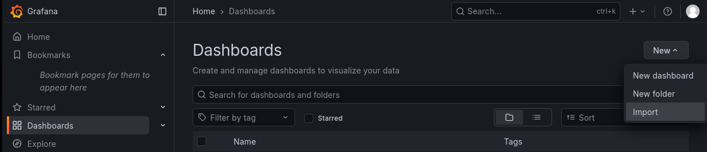
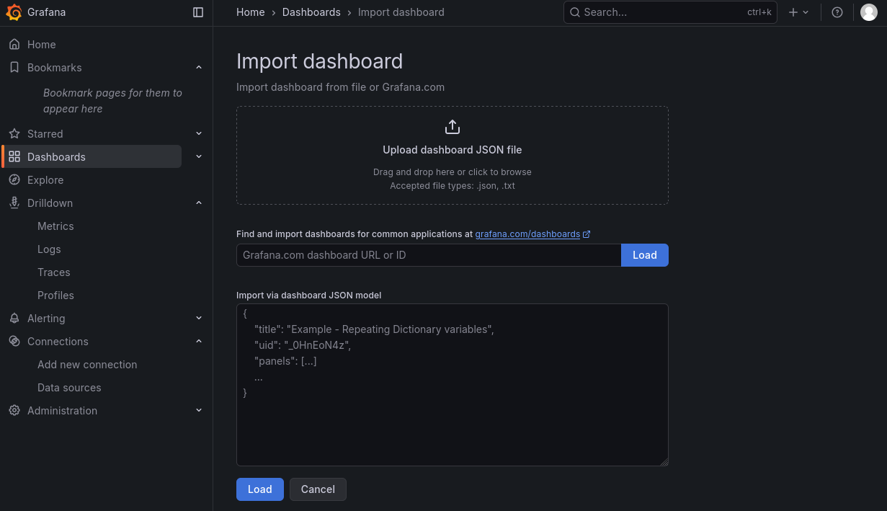

```{r setup, include=FALSE}
knitr::opts_chunk$set(fig.pos = "H", echo = TRUE)
library(ggplot2)
library(patchwork)
library(showtext)
showtext_auto()
```

# Wstęp teoretyczny

## Kubernetes

Kubernetes to otwartoźródłowy system orkiestracji kontenerów, opracowany pierwotnie przez Google,
a obecnie rozwijany przez Cloud Native Computing Foundation (CNCF). Umożliwia on automatyzację wdrażania,
skalowania i zarządzania aplikacjami kontenerowymi. Kubernetes abstrahuje fizyczną infrastrukturę, udostępniając
logiczny zestaw zasobów.

Jedną z kluczowych cech Kubernetes jest jego dynamiczny charakter - zasoby i kontenery mogą być tworzone,
usuwane i przenoszone pomiędzy węzłami klastra w sposób automatyczny. Ta elastyczność zwiększa
odporność systemu, ale jednocześnie utrudnia monitorowanie jego stanu i wydajności przez typowe rozwiązania monitoringu aplikacji.

W Kubernetesie wszystkie obiekty można podzielić na dwa: klastrowe oraz ograniczone do przestrzeni nazw. Te drugie są
wyizolowane logicznie od siebie, dzięki czemu można nazywać tak samo, oraz tworzyć ograniczenia pomiędzy przestrzeniami nazw tak,
aby aplikacje nie miały do siebie nawzajem dostępu, co uczyni klaster bezpieczniejszym. Niektóre z obiektów mogą być tylko klastrowe,
a niektore tylko w konkretnej przestrzeni nazw.

Każdy element Kubernetes posiada metadane, oraz właściwe parametry
(przeważnie, lecz nie zawsze zdefiniowane jako `spec:` w pliku YAML). Metadane zawierają m.in nazwę obiektu oraz przestrzeń nazw
w której się znajduje.

### Sieć w Kubernetes

W Kubernetes sieć jest zaprojektowana jako płaska struktura, w której każdy Pod otrzymuje swój własny,
unikalny adres IP. Dzięki temu Pody mogą komunikować się ze sobą bezpośrednio, bez potrzeby używania NAT (tłumaczenia adresów) wewnątrz klastra.

Kluczowe zasady działania:

* Wymagany Plugin (CNI): Kubernetes sam w sobie nie zapewnia warstwy sieciowej. Musisz wybrać i zainstalować wtyczkę CNI (Container Network Interface), taką jak Calico, Flannel czy Cilium. To ten plugin odpowiada za przydzielanie adresów IP i routing pakietów między Podami.
* Komunikacja Pod-Pod: Niezależnie od tego, na którym węźle (Node) znajdują się Pody, widzą się one tak, jakby były w tej samej sieci lokalnej.
* Ruch na zewnątrz (Bypassing Master): Gdy aplikacja na Worker Node chce połączyć się z Internetem lub zewnętrzną usługą, ruch wychodzi bezpośrednio z tego Workera.
* Ważne: Pakiety danych pomijają Master Node (Control Plane). Master służy jedynie do zarządzania klastrem (API, scheduler), ale nie pośredniczy w przesyłaniu danych użytkowych, nawet jeśli są na nim hostowane komponenty systemowe.

## Jitsi

Jitsi to platforma wideokonferencyjna open-source oparta na standardzie WebRTC.
Jej działanie opiera się na architekturze SFU (Selective Forwarding Unit). Oznacza to, że serwer nie "miesza"
obrazu wszystkich uczestników w jeden strumień (co wymagałoby ogromnej mocy obliczeniowej),
lecz przekazuje (forwarduje) odpowiednie pakiety wideo od jednego użytkownika do pozostałych.
Jitsi posiada wiele komponentów, ale omówimy tylko dwa najważniejsze z nich:

Kluczowe komponenty:

* JVB (Jitsi Videobridge) - JVB odbiera strumienie audio/wideo od użytkowników i przesyła je dalej.
  * Simulcast: JVB dba o jakość - przy słabym łączu JVB wysyła strumień o niższej jakości, nie obciążając przy tym nadawcy.
* Jicofo (Jitsi Conference Focus) - Zarządza sesjami konferencyjnymi.
  * Działanie: Nie dotyka mediów (obrazu/dźwięku). Zajmuje się logiką: pilnuje, kto jest w pokoju, kto ma prawo głosu, i przydziela uczestników do konkretnego mostka (JVB).
  * Sygnalizacja: Komunikuje się z użytkownikami (zazwyczaj przez serwer XMPP, np. Prosody) i instruuje JVB, co ma robić.

### Jitsi Octo (Relay)

W standardowym Jitsi wszyscy uczestnicy spotkania muszą być podłączeni do jednego mostka (JVB).

Octo pozwala połączyć wiele instancji JVB w jeden logiczny klaster.
W trybie Octo, JVB zachowuje się jednocześnie jak serwer (dla użytkowników) i jak klient (dla innych mostków JVB), przekazując pakiety między JVB.
To nadal Jicofo decyduje gdzie użytkownik się połączy.

Po włączeniu Octo, Jicofo rozdziela spotkania między różne mostki JVB na podstawie skonfigurowanej "strategii wyboru mostka" (z ang. _"bridge selection strategy"_).
Dostępnych strategii jest kilka, a domyślna w używanej przez nas konfiguracji to "RegionBasedBridgeSelectionStrategy", która stara się łączyć użytkowników z mostkami w ich regionie geograficznym, jednocześnie pozwalając na pewne odchylenia w celu równoważenia obciążenia.
Pozostałe (z wyjątkiem pliku Util.kt który zawiera funkcje pomocniczne) są widoczne na rysunku \ref{fig:bridge-selection-strategies}.

\begin{figure}[H]
\centering
\includegraphics[width=0.8\textwidth]{./res/bridge-selection-strategies.png}
\caption{Dostępne strategie wyboru mostka w Jitsi Octo}
\label{fig:bridge-selection-strategies}
\end{figure}

Kod odpowiedzialny za wybór mostka w przypadku tej funkcji składa się z wykorzystania kilku funkcji pomoczniczych, które starają się znaleźć najlepszy mostek dla użytkownika - funkcje te są również wykorzystane w innych metodach wyboru mostka, jednak te nie zostały przez nas przetestowane.

\begin{listing}[H]
\begin{minted}[breaklines]{kotlin}
return notLoadedAlreadyInConferenceInRegion(bridges, conferenceBridges, participantProperties, region)
            ?: notLoadedAlreadyInConferenceInRegionGroup(bridges, conferenceBridges, participantProperties, region)
            ?: notLoadedInRegion(bridges, conferenceBridges, participantProperties, region)
            ?: notLoadedInRegionGroup(bridges, conferenceBridges, participantProperties, region)
            ?: notLoadedAlreadyInConference(bridges, conferenceBridges, participantProperties)
            ?: notLoaded(bridges, conferenceBridges, participantProperties)
            ?: leastLoadedNotMaxedAlreadyInConference(bridges, conferenceBridges, participantProperties)
            ?: leastLoaded(bridges, conferenceBridges, participantProperties)
\end{minted}
\caption{Fragment kodu strategii RegionBasedBridgeSelectionStrategy}
\end{listing}

Powyższy kod stara się znaleźć najmniej obciążony mostek dla użytkownika, stosując się do następującej kolejności:

* Nieprzeładowany mostek w konferencji w danym regionie (lub jego grupie),
* Nieprzeładowany mostek w danym regionie (lub jego grupie), lecz niekoniecznie w konferencji,
* Nieprzeładowany mostek w regionie (lub jego grupie), kiedy konferencja ma mostki w regionie, lecz wszystkie są przeładowane,
* Najmniej przeładowany mostek znajdujący się w grupie regionu użytkownika oraz konferencji,
* Najmniej przeładowany mostek znajdujący się w grupie regionu użytkownika,
* Nieprzeładowany mostek znajdujący się w konferencji,
* Najmniej przeładowany mostek.

## Wybór narzędzi

Do postawienia klastra użyjemy programu Ansible.

Narzędzia z których korzystamy do zarządzania klastrem:

* Helm - do prostego wdrażania dużych aplikacji,
* kubectl - domyślny program do interkacji z klastrami Kubernetes,
* k9s - do testowania oraz szybszego sprawdzania informacji na klastrze.

Programy które wdrożymy na klastrze w kontenerach:

* Jitsi - nasz zestaw programów do wideokonferencji,
* Alloy - do zbierania metryk z Jitsi (dokładniej komponentu Videobridge),
* Mimir - baza danych do zbierania metryk,
* Grafana - do wizualizacji wstępnej (nie do tego dokumentu, do live demo) oraz prostszego wyeksportowania danych.

Jako, że nie posiadamy publicznego adresu IP, wybraliśmy także następujące narzędzia do udostępnienia Jitsi:

* Pangolin - oparty na WireGuard zestaw aplikacji umożliwiający łatwe udostępnianie usług po HTTP(s),
* Tailscale - oparty na WireGuard mesh'owy VPN pozwalający na łatwe łączenie urządzeń i tworzenie "wirtualnej sieci" między nimi,
* Coturn - serwer TURN oraz STUN umożliwiający przekazywanie ruchu multimedialnego przez NATy i firewalle.

Dwa z powyższych rozwiązań (Pangolin oraz Tailscale) zostały wybrane ze względu na fakt, iż były już wykorzystywane przez jedną osobę z zespołu.
Dodatkowo wykorzystanie zostany serwer należący do jednego członka zespołu mający publiczny adres IPv4, na którym postawione są wyżej wymienione aplikacje.

Do prostszego dołączenia wielu użytkowników skorzystamy z platformy `node.js` oraz dostępnej na niej biblioteki `puppeteer`.

# Scenariusz - projekt

## Sieć

Postawienie Jitsi tak, aby było publicznie dostępne, wymaga otwarcia kilku portów (wg. strony: https://meetrix.io/blog/webrtc/jitsi/meet/what-port-your-should-open.html): 443 dla HTTPS, 10000 UDP dla ruchu multimedialnego, oraz 4443 TCP jako alternatywa dla 10000 UDP.
Port 443, tj. HTTPS, jest niezbędny do części webowej Jitsi, a także do sygnalizacji WebRTC. Port 10000 UDP jest używany do przesyłania strumieni audio i wideo między klientami a serwerem Jitsi Videobridge. Port 4443 TCP służy jako alternatywna ścieżka dla ruchu multimedialnego, gdy port 10000 UDP jest zablokowany lub niedostępny.

Ze względu na ograniczenia otrzymanego środowiska (brak publicznego adresu IP), użyty zostanie serwer jednego z członków zespołu, który posiada publiczny adres IP i już służy do udostępniania usług w sieci publicznej.

Udostępnienie portu 443 jest możliwe dzięki Pangolinowi, który odpowiednio przekieruje ruch wysyłany pod odpowiedni adres URL do klastra Kubernetes.
Pangolin likwiduje również potrzebę na ręczne zarządzanie certyfikatami TLS dla Jitsi, ponieważ automatycznie generuje i odnawia certyfikaty Let's Encrypt dla skonfigurowanych domen.

W teorii porty 10000 UDP oraz 4443 TCP mogłyby być również przekierowane przez Pangolina, jednakże jego backend (Traefik) wymaga podawania pełnych domen dla reguł routingu, co jest problematyczne w przypadku gdy część aplikacji wymaga adresu IP w formie numerycznej.
Dotychczasowe doświadczenie związane z udostępnianiem usług na "czystych" TCP / UDP przez Pangolina jest znacznie mniej intuicyjne niż w przypadku HTTP(s).
Z tego powodu, do przekierowania ruchu multimedialnego zostanie użyty Tailscale, który umożliwia łatwe tworzenie bezpiecznych połączeń VPN między urządzeniami.
Dzięki Tailscale, można stworzyć dodatkowy kontener który będzie mieć dostęp jedynie do sieci JVB i będzie przekazywać mu ruch multimedialny przychodzący z publicznego serwera.
Po stronie używanego przez nas serwera z publicznym IP wymagane będzie jedynie dodanie krótkiego wpisu w iptables, który przekieruje ruch z portu 10000 na docelowy adres IP sieci Tailscale poda dołączonego do JVB.

Dodatkowo na samym serwerze z publicznym IP zostanie uruchomiony serwer Coturn, który będzie służył jako serwer STUN/TURN dla Jitsi.
Jego zadaniem będzie pomoc w nawiązywaniu połączeń WebRTC, szczególnie w sytuacjach gdy klienci znajdują się za NATami lub firewallami.
Serwer Coturn będzie skonfigurowany do obsługi zarówno protokołu UDP, jak i TCP na standardowym porcie 3478, co zapewni maksymalną kompatybilność z różnymi środowiskami sieciowymi użytkowników końcowych.
Dzięki temu rozwiązaniu, Jitsi będzie mogło efektywnie obsługiwać połączenia multimedialne nawet w trudnych warunkach sieciowych.

Sieć została zwizualizowana na rysunku \ref{fig:siec}.

\begin{figure}[H]
\centering
\includegraphics[width=1.0\textwidth]{./res/siec.png}
\caption{Projekt sieci do udostępnienia Jitsi publicznie}
\label{fig:siec}
\end{figure}


## Zebranie danych

Mając zdefiniowane Jitsi, przejdźmy do monitoringu. Chcemy, aby zbierał on metryki, po czym wysyłał je
do bazy danych. Dodatkowo, chcemy mieć możliwość prostego przeglądania tych danych i tworzenia paneli wizualizacyjnych.

Wszystko to wizualizuje rysunek \ref{fig:monitoring-scenario}.

\begin{figure}[H]
\center
\begin{tikzpicture}
\node[draw, rectangle, minimum width=14cm, minimum height=8cm] (app-cluster) {};
\node at (app-cluster.north) [yshift=6mm] {Klaster} {};
\node[draw, dashed, rectangle, minimum width=3cm, minimum height=3cm, anchor=east] at ([xshift=6cm]app-cluster.center) (nsuser1) {Komponenty Jitsi};
\node at (nsuser1.south) [yshift=-3mm] {Przestrzeń nazw Jitsi} {};
\node[draw, dashed, rectangle, minimum width=6cm, minimum height=6.5cm, anchor=west] at ([xshift=25pt]app-cluster.west) (monitoring-namespace) {};
\node[draw, rectangle, minimum width=3cm, minimum height=1cm, anchor=east] at ([yshift=-1.6cm, xshift=-5pt]monitoring-namespace.east) (alloy) {Apl. zbierająca metryki};
\node[draw, rectangle, minimum width=3cm, minimum height=1cm, anchor=east] at ([yshift=1.6cm, xshift=-5pt]monitoring-namespace.east) (mimir) {Apl. bazy danych};
\node[draw, rectangle, minimum width=3cm, minimum height=1cm, anchor=east] at ([xshift=25pt]monitoring-namespace.center) (grafana) {Apl. wizualizacyjna};

\draw[->, densely dotted]
    (alloy.east)
    -- (nsuser1);

\draw[->, densely dotted]
    ([xshift=13pt]alloy.north)
    -- (mimir);

\draw[<-, densely dotted]
    (mimir.west)
    -- ++(-0.6, 0)
    -- (grafana.north);


\end{tikzpicture}
\caption{Scenariusz monitoringu}
\label{fig:monitoring-scenario}
\end{figure}

# Replikacja środowiska

Najprostszym sposobem jest użycie jednego z narzędzi: K3S, Minikube, Kind.
Programy te upraszczają zestawienie środowiska Kubernetes, upraszczając większość
niezbędnych konfiguracji. Można wtedy przejść od razu do punktu z wdrożeniem Jitsi.

> Uwaga! Korzystając z jednego z tych narzędzi, jest bardzo wysokie prawdopodobieństwo, że Octo (Relay) nie będzie działał!

Oprócz samego Kubernetes i domyślnego narzędzia `kubectl`, przyda się również
`helm`, które jest szeroko stosowanym menadżerem paczek dla Kubernetes.

## Maszyny

W naszym przypadku skorzystaliśmy z trzech maszyn wirtualnych:

* maszyna o adresie 10.29.4.153 (control plane): 2 rdzenie, 2GB RAMu;
* maszyny o adresach 10.29.4.154, 10.29.4.155 (worker): 4 rdzenie, 4GB RAMu.

## Kubernetes

Nasze środowisko zostało wdrożone za pomocą przygotowanych przez nas skryptów Ansible, które dostępne są w repozytorium:
https://github.com/SebSK3/uiam-prepare-k8s

Najważniejszym elementem jest przygotowanie maszyn (node), których wartości można znaleźć w folderze `host_vars/`.
Użytkownik, powinien dostosować następujące wartości:

* `ansible_host` - lokalny adres IP maszyny,
* `ansible_user` - użytkownik do którego będzie się podłączać skrypt ansible,
* `ansible_ssh_pass` - hasło do maszyny,
* `ansible_ssh_port` - port na którym nasłuchuje SSH na docelowej maszynie.

## coturn

Serwer coturn zostanie uruchomiony na serwerze z publicznym IP, na którym zostaną otwarte porty 3478 UDP oraz 3478 TCP.
Uruchomienie będzie korzystać z zainstalowanego wcześniej Dockera oraz zmodyfikowanego pliku przykładowego dostępnego na stronie GitHub projektu coturn: https://github.com/coturn/coturn/blob/master/docker/docker-compose-all.yml, widocznego na rysunku \ref{fig:turn-compose}.

\begin{figure}[H]
\centering
\includegraphics[width=0.8\textwidth]{./res/131-turn-compose.png}
\caption{Plik docker compose dla serwera coturn}
\label{fig:turn-compose}
\end{figure}

Coturn może korzystać z baz danych do przechowywania użytkowników, jednakże w naszym przypadku skorzystamy z prostszej metody, czyli zdefiniowanie sekretu, którego użytkownik może użyć do uwierzytelnienia się na serwerze.

\begin{figure}[H]
\centering
\includegraphics[width=0.8\textwidth]{./res/130-turnconfig.png}
\caption{Plik konfiguracyjny serwera coturn}
\label{fig:turn-config}
\end{figure}

## Jitsi

Po uruchomieniu klastra, posiadając działający `kubectl` oraz `helm`, możemy przejść do wdrożenia Jitsi.
Ze względu na skorzystanie z serwera coturn, wykorzystany plik `values.yaml` widoczny na rysunku \ref{fig:helm-jitsi} jest większy niż byłby, gdyby takiego serwera nie było.
Linijki 5 oraz 16-23 mogłyby w takim przypadku zostać usunięte.

\begin{figure}[H]
\centering
\includegraphics[width=0.8\textwidth]{./res/100-podstawowe-jitsi.png}
\caption{Plik konfiguracyjny Helm dla Jitsi}
\label{fig:helm-jitsi}
\end{figure}

Ze względu na konfigurację serwera coturn, która wymaga od użytkownika podania sekretu w celu uwierzytelnienia się, wcześniej wspomniane linijki 16-23 pozwalają serwerowi Jitsi na przekazanie tych danych użytkownikowi, który następnie może ich użyć w celu skorzystania z serwera coturn.
W teorii możliwe jest wydobycie sekretu z tej komunikacji, jednakże szacujemy że jest to relatywnie małe zagrożenie (niewiele osób wie o istnieniu usługi, jeszcze mniej raczej potrzebuje serwera coturn), więc jest to akceptowalne ryzyko.

Sam sekret znajduje się w osobnym pliku `turn-secret.yaml`, którego przykład jest widoczny na rysunku \ref{fig:turn-secret}.
Oprócz niego znajdują się w nim również adres oraz port.

\begin{figure}[H]
\centering
\includegraphics[width=0.8\textwidth]{./res/101-secret-do-turna.png}
\caption{Plik sekretu dla serwera coturn}
\label{fig:turn-secret}
\end{figure}

Posiadając powyższe dwa pliki, możliwe jest uruchomienie Jitsi przy pomocy dwóch komend, widocznych na rysunku \ref{fig:jitsi-deploy}.
Pierwsza aplikuje sekret, a druga instaluje Jitsi przy pomocy Helma.

\begin{figure}[H]
\centering
\includegraphics[width=0.8\textwidth]{./res/102-komenda-do-postawienia.png}
\caption{Komendy do uruchomienia Jitsi}
\label{fig:jitsi-deploy}
\end{figure}

Tym samym Jitsi uruchamia się na klastrze, lecz jego przetestowanie nie jest możliwe bez udostępnienia go publicznie.

### Udostępnienie Jitsi publicznie

W celu instalacji Pangolina, niezbędne jest uprzednie zainstalowanie Dockera na serwerze z publicznym IP.
W naszym przypadku serwer jest użytkowany od ponad roku i miał już zainstalowanego Dockera.
Trudno jest nam określić konkretnie jaka wersja instalowana była wtedy, lecz ze względu na użytkowanie systemu Ubuntu na serwerze, najpewniej wykorzystana była ówczesna wersja poradnika do instalacji Dockera na Ubuntu, aktualnie dostępna pod adresem: https://docs.docker.com/engine/install/ubuntu/.

Instrukcje instalacji Pangolina znajdują się pod adresem: https://docs.pangolin.net/self-host/quick-install.
Wymagane jest pobranie instalatora, a następnie uruchomienie go z uprawnieniami administracyjnymi:

\begin{listing}[H]
\begin{minted}{bash}
curl -fsSL https://static.pangolin.net/get-installer.sh | bash
sudo ./installer
\end{minted}
\caption{Komendy do instalacji Pangolina}
\end{listing}

Instalator poprosi o podanie wykorzystywanej domeny, adresu pod którym ma być dostępny dashboard (pod wcześniej podaną domeną), email do logowania oraz ceryfikatów Let's Encrypt oraz czy tunelowanie powinno być włączone (które należy włączyć aby móc skorzystać z łatwej konfiguracji jaką oferuje Pangolin).
Po kilkuminotwej instalacji należy utworzyć konto administratorskie, po czym możliwe będzie zalogowanie się do dashboardu Pangolina.

Przy użyciu Pangolina, możliwe jest udostępnianie usług na tym samym urządzeniu, na którym jest on zainstalowany, lecz w tym konkretnym przypadku interesuje nas skorzystanie z możliwości udostępniania usług znajdujących się na innych urządzeniach.
W tym celu należy utworzyć "site", czyli połaczenie z danym urządzeniem.
Na stronie głównej dashboardu Pangolina, należy kliknąć przycisk "Create Site", po czym nadać mu nazwę oraz potencjalnie zmienić automatycznie wygenerowany zakres adresów IP wykorzystywanych przez utworzoną "pod spodem" sieć WireGuard, jak zostało to pokazane na rysunku \ref{fig:pangolin-site}.
Poniżej znajdują się również losowo wygenerowane dane wykorzystywane w celu połączenia się do serwera.

\begin{figure}[H]
\centering
\includegraphics[width=0.8\textwidth]{./res/110-tworzenie-site-pangolin.png}
\caption{Tworzenie "site" w Pangolinie}
\label{fig:pangolin-site}
\end{figure}

Dane te należy zapisać w miejscu docelowym - w naszym przypadku będzie to klaster Kubernetes.
Pangolin ma przygotowany poradnik do uruchomienia klienta o nazwie Newt na klastrze Kubernetes, dostępny pod adresem: https://docs.pangolin.net/manage/sites/install-kubernetes.
W tym celu tworzymy plik 'newt-cred.yaml', o zawartości widocznej na rysunku \ref{fig:pangolin-creds}.

\begin{figure}[H]
\centering
\includegraphics[width=0.8\textwidth]{./res/111-zapisanie-credentiali.png}
\caption{Zapisanie credentiali Pangolina w pliku YAML}
\label{fig:pangolin-creds}
\end{figure}

Dane z tego sekretu są następnie wykorzystane w pliku `values.yaml` dla Newt'a (klienta Pangolina), widocznego na rysunku \ref{fig:pangolin-newt-values}, który pozwala na skonfigurowanie Newt'a do połączenia się z serwerem Pangolina.

\begin{figure}[H]
\centering
\includegraphics[width=0.8\textwidth]{./res/112-newt-values.png}
\caption{Plik values.yaml dla Newt'a (klienta Pangolina)}
\label{fig:pangolin-newt-values}
\end{figure}

Z przygotowanymi plikami konfiguracyjnymi, możliwe jest ich zaaplikowanie poprzez użycie komend widocznych na rysunku \ref{fig:pangolin-newt-deploy}.
Kluczowe jest uprzednie dodanie repozytorium Pangolina do Helma, co pozwala na zainstalowanie Newt'a przy pomocy jednej komendy Helm.

\begin{figure}[H]
\centering
\includegraphics[width=0.8\textwidth]{./res/113-samo-postawienie-newt.png}
\caption{Komendy do uruchomienia Newt'a (klienta Pangolina) na klastrze Kubernetes}
\label{fig:pangolin-newt-deploy}
\end{figure}

Po chwili, w dashboardzie Pangolina powinien pojawić się nowy "site", widoczny na rysunku \ref{fig:pangolin-newt-result}.

\begin{figure}[H]
\centering
\includegraphics[width=0.8\textwidth]{./res/114-rezultat.png}
\caption{Utworzony site (K8s) widoczny w dashboardzie Pangolina}
\label{fig:pangolin-newt-result}
\end{figure}

Następnie możliwe jest utworzenie dostępu do strony Jitsi poprzez Pangolina.
W tym celu należy przejść do zakładki "Resources" w dashboardzie Pangolina, a następnie kliknąć przycisk "Create Resource".
Pojawi się formularz, widoczny na rysunku \ref{fig:pangolin-route}, w którym należy podać nazwę zasobu, typ (w naszym przypadku HTTP), domenę pod którą ma być dostępne Jitsi (w naszym przypadku `jitsi.google.sex.pl`), oraz adres pod który będą przekierowane żądania (w naszym przypadku adres usług Jitsi w klastrze Kubernetes, czyli `myjitsi-jitsi-meet-web.default.svc.cluster.local`).
Wykorzystujemy w tym przypadku wewnętrzny adres usługi Kubernetes, ponieważ Newt (klient Pangolina) działa na klastrze i ma dostęp do jego sieci oraz jest w stanie rozwiazać ten adres dzięki wewnętrznemu DNS Kubernetes.

\begin{figure}[H]
\centering
\includegraphics[width=0.8\textwidth]{./res/115v2-tworzenie-dostepu.png}
\caption{Tworzenie dostępu do Jitsi poprzez Pangolina}
\label{fig:pangolin-route}
\end{figure}

Utworzony zasób ma automatycznie włączone TLS, widoczne na rysunku \ref{fig:pangolin-tls}, dzięki czemu dostęp do Jitsi będzie możliwy poprzez HTTPS.

\begin{figure}[H]
\centering
\includegraphics[width=0.8\textwidth]{./res/116-tls.png}
\caption{Konfiguracja TLS dla dostępu do Jitsi poprzez Pangolina}
\label{fig:pangolin-tls}
\end{figure}

Ze względu na stosowanie w celu publicznego wystawiania aplikacji oraz jednoczesnego kontroli dostępu do nich, Pangolin domyślnie włącza SSO (Single Sign-On) dla wszystkich udostępnianych aplikacji.
W naszym przypadku nie jest to potrzebne, więc należy tę opcję wyłączyć, co zostało pokazane na rysunku \ref{fig:pangolin-sso-off}.

\begin{figure}[H]
\centering
\includegraphics[width=0.8\textwidth]{./res/117-wylaczenie-sso.png}
\caption{Wyłączenie SSO dla dostępu do Jitsi poprzez Pangolina}
\label{fig:pangolin-sso-off}
\end{figure}

W przypadku pozostawienia domyślnej opcji włączenia SSO, przy próbie dostępu do Jitsi pojawi się okno logowania, widoczne na rysunku \ref{fig:pangolin-sso-on}.

\begin{figure}[H]
\centering
\includegraphics[width=0.8\textwidth]{./res/118-sso.png}
\caption{Wygląd okna SSO przy włączonej opcji dla dostępu do Jitsi poprzez Pangolina}
\label{fig:pangolin-sso-on}
\end{figure}

Po takiej konfiguracji, możliwe jest wejście na stronę naszego Jitsi oraz utworzenie pokoju.
Rozmowę można jednak prowadzić jedynie przez około minutę, po czym użytkownik jest rozłączany z powodu braku dostępu do JVB.
Dzieje się tak, ponieważ nie zostało skonfigurowane przekierowanie ruchu multimedialnego do JVB w klastrze Kubernetes.

Aby rozwiązać ten problem, skorzystamy z Tailscale.

Tailscale wymaga utworzenia konta, po czym możliwe jest wygenerowanie klucza sekretu, który pozwoli na automatyczne dołączenie urządzenia do sieci Tailscale.
Na urządzeniu które chcemy dołączyć do sieci Tailscale należy zainstalować Tailscale, a następnie uruchomić go z wygenerowanym sekretem.

\begin{listing}[H]
\begin{minted}{bash}
curl -fsSL https://tailscale.com/install.sh | sh
sudo tailscale up --authkey <TAILSCALE_AUTH_KEY>
\end{minted}
\caption{Komendy do instalacji i uruchomienia Tailscale}
\end{listing}

Te komendy zostały użyte na serwerze z publicznym IP.

Tailscale oferuje zestaw możliwości uruchomienia na klastrze Kubernetes, opisany dokładnie pod adresem: https://tailscale.com/learn/managing-access-to-kubernetes-with-tailscale.
Z tego poardnika skorzystamy z opcji uruchomienia Tailscale jako proxy do konkretnej usługi Kubernetes (nie całej sieci), minimalizując w ten sposób potencjalne zagrożenia bezpieczeństwa.
Aby połączyć Tailscale z JVB w klastrze Kubernetes, należy utworzyć sekret Kubernetes, który będzie przechowywał klucz autoryzacyjny Tailscale (inny niż użyty na serwerze publicznym), widoczny na rysunku \ref{fig:tailscale-secret}.

\begin{figure}[H]
\centering
\includegraphics[width=0.8\textwidth]{./res/120-tailscale-secret.png}
\caption{Sekret Tailscale dla JVB}
\label{fig:tailscale-secret}
\end{figure}

Dodatkowo rekomendowane jest stworzenie odpowiednich ról RBAC, które pozwolą Tailscale na aktualizację sekretu z adresem IP przydzielonym przez Tailscale, widocznych na rysunku \ref{fig:tailscale-rbac}.

\begin{figure}[H]
\centering
\includegraphics[width=0.8\textwidth]{./res/121-tailscale-rbac.png}
\caption{Konfiguracja RBAC dla Tailscale w celu aktualizacji sekretu}
\label{fig:tailscale-rbac}
\end{figure}

Następnie można skonfigurować uruchomienie samego Tailscale, na bazie rekomendowanych ustawień z poradnika powyżej, widocznego na rysunku \ref{fig:tailscale-proxy}
Kluczowe w konfiguracji jest użycie odpowiedniego serviceAccountName, aby pod uruchamiał się pod tymże kontem, kontener inicjalizujący, który zezwala na przekierowanie pakietów IP (co jest wymagane da działania Tailscale w trybie proxy) oraz zmienne środowiskowe - klucz autentykujący oraz adres IP usługi, do której chcemy przekierować ruch.

\begin{figure}[H]
\centering
\includegraphics[width=0.8\textwidth]{./res/122-tailscale-proxy.png}
\caption{Plik konfiguracyjny Tailscale Proxy do przekierowania ruchu do JVB}
\label{fig:tailscale-proxy}
\end{figure}

Znalezienie usługi możliwe jest poprzez komendę `kubectl get services`, gdzie wyświetlony będzie również jej adres IP.
Na rysunku \ref{fig:tailscale-why-ip} pokazany jest wynik działania tejże komendy, wraz z zaznaczonym adresem IP JVB, który został użyty w celu uruchomienia proxy Tailscale.

\begin{figure}[H]
\centering
\includegraphics[width=0.8\textwidth]{./res/123-dlaczego-takie-ip.png}
\caption{Usługi uruchomione na klastrze Kubernetes, z zaznaczonym adresem IP JVB}
\label{fig:tailscale-why-ip}
\end{figure}

Po przygotowaniu powyższych plików można je zaaplikować przy użyciu kilku komend `kubectl apply`, widocznych na rysunku \ref{fig:tailscale-deploy}.
W przeciwieństwie do Pangolina czy Jitsi, Tailscale wykorzystuje obraz Dockera, więc nie jest potrzebne użycie Helma do jego instalacji.

\begin{figure}[H]
\centering
\includegraphics[width=0.8\textwidth]{./res/124v2.png}
\caption{Komendy do uruchomienia Tailscale na klastrze Kubernetes}
\label{fig:tailscale-deploy}
\end{figure}

Po uruchomieniu komend możliwa jest komunikacja między serwerem z publicznym IP oraz klastrem poprzez sieć Tailscale.
Odpowiednie urządzenie pojawia się również w panelu administratorskim Tailscale, widoczne na rysunku \ref{fig:tailscale-result}.

\begin{figure}[H]
\centering
\includegraphics[width=0.8\textwidth]{./res/125-rezultat.png}
\caption{Urządzenie widoczne w panelu Tailscale po uruchomieniu klienta na klastrze Kubernetes}
\label{fig:tailscale-result}
\end{figure}

Ustanowiona komunikacja umożliwia przekierowanie ruchu wchodzącego na port 10000 protokołu UDP serwera z publicznym IP do JVB postawionego w klastrze.
W tym celu skorzystamy z iptables, w którym takie przekierowanie możliwe jest przy użyciu dwóch komend, widocznych na rysunku \ref{fig:tailscale-routing}.
Ze względu na dynamiczny routing jaki umożliwia Tailscale, wymagane jest jedynie podanie adresu IP, takiego jaki pokazał się w panelu administracyjnym na rysunku \ref{fig:tailscale-result}.

\begin{figure}[H]
\centering
\includegraphics[width=0.8\textwidth]{./res/126-routing-vanguard.png}
\caption{Komendy iptables do przekierowania ruchu z serwera publicznego do JVB w klastrze Kubernetes}
\label{fig:tailscale-routing}
\end{figure}

W ten sposób skonfigurowane proxy na serwerze umożliwia komunikację użytkownika z JVB, czego efektem jest możliwe przeprowadzenie rozmowy, której test widoczny jest na rysunku \ref{fig:jitsi-semi-final}.
Rozmowa była przeprowadzona przy użyciu dwóch urządzeń w tej samej sieci - laptopa oraz komputera desktop, a także telefonu połączonego do innej sieci przez 5G.

\begin{figure}[H]
\centering
\includegraphics[width=0.8\textwidth]{./res/140-efekt.png}
\caption{Działająca rozmowa w Jitsi, dostępna publicznie}
\label{fig:jitsi-semi-final}
\end{figure}

### Konfiguracja Jitsi z Octo

Do użycia Octo musimy zmodyfikować jego domyślne `values.yaml` poprzez dopisanie:

```yaml
octo:
  enabled: True
```

Przeskalowanie samego JVB polega na dodaniu liczby instancji w `jvb.replicaCount`:

```yaml
jvb:
  replicaCount: 2
```

Jednym z wymogów Octo jest to, aby każdy JVB ogłaszał stały, routowalny adres IP, pod którym jest osiągalny przez inne JVB oraz klientów.
Opcja ta powoduje, że JVB wykorzystuje zewnętrzny adres IP węzła (Node IP), a nie adres IP dla Pod, który nie jest routowalny pomiędzy węzłami ani dla klientów.

```yaml
jvb:
  # Każdy Pod JVB ogłasza wyłącznie zewnętrzny adres IP swojego Node
  useNodeIP: true
```

Dodatkowo JVB musi wystawiać swój port bezpośrednio na węźle, na którym jest uruchomiony.
Użycie hostPort sprawia, że port UDP Jitsi Videobridge jest dostępny bezpośrednio na adresie IP węzła.
Jednocześnie oznacza to, że na jednym węźle może działać tylko jedna instancja JVB, ponieważ ten sam port nie może być współdzielony przez wiele podów.

```yaml
jvb:
  # Wystaw port interfejsu JVB na świat zewnętrzny tylko na węzłach,
  # które faktycznie go posiadają
  useHostPort: true
```

## Monitoring

Do zweryfikowania prędkości wdrożymy prostą instancję Grafana (Mimir - bazy danych szeregów czasowych, Alloy - do przesyłania metryk, Grafana - do wizualizacji
i przerobienia danych).

### Baza danych

Do przechowywania metryk został wybrany program Mimir w trybie mikroserwisów. Wybrany został tryb wdrożenia,
gdzie Mimir rozbity jest na wiele mikroserwisów, ponieważ dobrze działa ona na Kubernetes. Istnieje także
architektura, gdzie Mimir zamknięty jest w jednym pliku binarnym. Mikroserwisy pozwalają m.in.
na skalowanie aplikacji w prostszy sposób (skalowanie pojedyńczych komponentów), a także zapewnia odporność
na przerwę w pracy, ponieważ pozwala na niedostępność pojedyńczych elementów, a nie całej aplikacji.

Został on skonfigurowany w następujący sposób:

\begin{listing}[H]
\begin{minted}{yaml}
---
### Sekcja 1 ########################################
mimir:
  structuredConfig:
    ingest_storage:
      enabled: false
    ingester:
      push_grpc_method_enabled: true
    common:
      storage:
        backend: "s3"
        s3:
          endpoint: "mimir-minio.svc.cluster.local:9000"
          insecure: true
          access_key_id: "grafana-mimir"
          secret_access_key: "supersecret"
### Sekcja 2 ########################################
store_gateway:
  zoneAwareReplication:
    enabled: false
  persistentVolume:
    enabled: false
ingester:
  zoneAwareReplication:
    enabled: false
  persistentVolume:
    enabled: false
compactor:
  persistentVolume:
    enabled: false
ruler:
  persistentVolume:
    enabled: false
minio:
  persistence:
    enabled: false
### Sekcja 3 ########################################
kafka:
  enabled: false
alertmanager:
  enabled: false
nginx:
  enabled: false
rollout_operator:
  enabled: false
\end{minted}
\caption{Plik values.yaml programu Mimir}
\end{listing}

Idąc od góry:

1. W pierwszej sekcji ustawiona jest konfiguracja samego Mimir. Wyłączony jest `ingest_storage`, a dodatkowo `ingester` (jeden z komponentów) przyjmuje
`push_grpc_method_enabled: true`, ponieważ nie chcemy używać architektury Mimir 3.0, która używa Kafki.
W `storage` jest konfiguracja kubełków S3, w których przechowywane są metryki, alerty itd.
`storage` ustawiony jest w `common`, dzięki czemu wszystkie `Pod` otrzymują tą wspólną konfigurację.
2. W sekcji drugiej wymienione są używane mikroserwisy Mimir np. `compactor`, `ruler`. Wyłączone mają one `persistence`, czy też `persistentVolume`,
ponieważ w przypadku testowania niepotrzebne jest nam długotrwałe przechowywanie metryk. Dane są utracone przy restarcie kontenera.
`zoneAwareReplication` jest również wyłączone, ponieważ mamy jeden klaster składający się z trzech maszyn wirtualnych i niej jesteśmy w stanie rozłożyć aplikacji
na więcej klastrów, czy fizycznych lokalizacji, które byłyby tzw. failure domain.
3. W sekcji trzeciej wyłączone są komponety Mimir, które nie są nam potrzebne do naszego przypadku użycia.

Wdrożenie Mimir następuje za pomocą komend:

```
$ helm repo add grafana https://grafana.github.io/helm-charts
$ helm install mimir grafana/mimir-distributed --namespace mimir --values values.yaml
```

Komendy robią następująco:

1. Dodaje repozytorium `grafana`, z którego pobrany zostanie chart
2. Instaluje instancje aplikacji `mimir`, używając chart `grafana/mimir-distributed` w przestrzeni nazw `mimir`, o wartościach `values.yaml`

### Program do zbierania i wysyłania metryk

Program do wysyłania i zbierania metryk w naszym wypadku to Alloy.

Na początku skonfigurujemy nasz program, poprzez obiekt Kubernetes ConfigMap, który trzyma
dane na zasadzie klucz: wartość.

\begin{listing}[H]
\begin{minted}{yaml}
---
apiVersion: "v1"
kind: "ConfigMap"
metadata:
  name: "alloy-config-map"
  namespace: "alloy"
data:
  config: |-
      remote.kubernetes.secret "credentials" {
        name = "monitoring-secret"
        namespace = "alloy" 
      }
      prometheus.remote_write "mimir" {
        endpoint {
          url = "http://mimir-gateway.monitoring.svc:80/api/v1/push"
          basic_auth {
            username = "admin"
            password = remote.kubernetes.secret.credentials.data["password"]
          }
        }
      }
      prometheus.operator.servicemonitors "jitsi" {
        forward_to = [prometheus.remote_write.mimir.receiver]
        namespaces = ["default"]
      }
\end{minted}
\caption{Obiekt ConfigMap dla programu Alloy}
\end{listing}

Idąc od góry:

1. Sekcja `remote.kubernetes.secret` definiuje, że dane autoryzujące, z których później będzie
   korzystać, będą w obiekcie typu Secret, o nazwie `monitoring-secret` w przestrzeni nazw `Alloy`.
2. Sekcja `prometheus.remote_write` definiuje gdzie mają być przesyłane dane. Definiują endpoint, czyli
   punkt końcowy, gdzie podany jest URL, oraz dane do autoryzacji. Jak można zauważyć, hasło pobierane jest
   z wcześniej zdefiniowanego sekretu, o kluczu "password".
3. Sekcja `prometheus.operator.servicemonitors` określa typową statyczną aplikację (w naszym wypadku Jitsi). Wskazuje przestrzeń nazw, gdzie znajduje
   się ServiceMonitor z którego ma korzystać do monitorowania aplikacji.

Aby wdrożyć ConfigMap wystarczy zapisać go w pliku i wdrożyć za pomocą `kubectl apply -f <nazwa_pliku>`.

Do wdrożenia samego programu skorzystamy z prostych wartości, które zapiszemy w pliku `values.yaml` (dla wygody
w innym folderze niż Mimir):

\begin{listing}[H]
\begin{minted}{yaml}
---
alloy:
  configMap:
    create: false
    name: "alloy-config-map"
    key: "config"
serviceMonitor:
  enabled: false
\end{minted}
\caption{Wartości values.yaml dla konfiguracji programu Alloy}
\end{listing}

To, co robi ten fragment wartości, to:

1. Wyłącza tworzenie domyślnej ConfigMap (która zawiera konfigurację programu).
2. Wskazuje na stworzoną przez nas ConfigMap.
3. Wskazuje klucz w którym znajduje się faktyczna wartość w której istnieje konfiguracja.
4. Wyłącza domyślny serviceMonitor, który jest tworzony aby Alloy mógł monitorować sam siebie (na potrzeby testów, aby
   nie zaśmiecać niepotrzebnymi danymi naszego eksperymentowania).

Wdrożenie jest analogiczne do programu Mimir:

```
$ helm install alloy grafana/alloy --namespace alloy --values values.yaml
```

### Aplikacja prezentowania danych

Do prezentowania zbieranych danych wykorzystywany jest program Grafana. 
Skonfigurowana została ona w następujący sposób:

\begin{listing}[H]
\begin{minted}{yaml}
---
adminUser: "admin"
adminPassword: "admin"
\end{minted}
\caption{Plik values.yaml programu Grafana}
\end{listing}

Powyższa konfiguracja zawiera plik konfiguracyjny Grafany `values.yaml`, który konfiguruje
użytkownika `admin` o haśle `admin`, co w wersji produkcyjnej powinno być schowane w sekrecie, ale dla celów testowych nie ma to większego znaczenia.

Wdrożenie następuje za pomocą komend:

```
$ helm repo add grafana https://grafana.github.io/helm-charts
$ helm install grafana grafana/grafana --namespace grafana --values values.yaml
```

Komendy robią następująco:

1. Dodaje repozytorium `grafana`, z którego pobrany zostanie chart (repozytorium wystarczy dodać raz, więc jeżeli było to zrobione wcześniej, to można pominąć)
2. Instaluje instancje aplikacji `grafana`, używając chart `grafana/grafana` w przestrzeni nazw `grafana`, o wartościach `values.yaml`

Aby połączyć się z programem Grafana należy przekierować port z Kubernetes na swoją maszynę:

```
$ export POD_NAME=$(kubectl get pods --namespace grafana \
-l "app.kubernetes.io/name=grafana,app.kubernetes.io/instance=grafana" \
-o jsonpath="{.items[0].metadata.name}")
$ kubectl --namespace grafana port-forward $POD_NAME 3000
```

> Uwaga! Wymaga to, abyśmy mieli dostęp do klastra z naszej maszyny.

Użyliśmy istniejącego już panelu (ang. dashboard) Grafany dla Jitsi: https://grafana.com/grafana/dashboards/12098-jitsi-meet/, przedstawiającego zebrane metryki z Jitsi.
Poniżej zaprezentowano jak zaimportować panel w programie Grafana:

Należy pobrać plik JSON ze strony podanej powyżej.

Aby zaimportować panel, wystarczy wejść do Grafana w zakładkę "Dashboards" oraz wybrać "New" po czym przejść do opcji "Import".



Po przejściu do opcji "Import" wystarczy wysłac plik JSON panelu oraz wcisnąć "Load".



# Testowanie oraz omówienie wyników

Twórcy Jitsi utrzymują, że ich program bardzo dobrze się skaluje. Według oficjalnych pomiarów:

* Dla 1056 strumieni wideo z bitrate 550mbit/s zużycie CPU to tylko 20% przy czterordzeniowym procesorze,
* Dla 1056 strumieni wideo zużycie RAMu nie przekroczyło 1.5GB.

Tworzy to problem stworzenia prawdziwego testu, ponieważ nie posiadamy zasobów aby włączyć tyle strumieni z taką przepustowością.
Nie mniej, spróbowaliśmy zbadać jak najdokładniej co dzieje się, kiedy Jitsi jest obciążone.

Wykorzystaliśmy poniższy skrypt do testowania różnych scenariuszy:

\begin{listing}[H]
\begin{minted}{js}
const puppeteer = require('puppeteer');
const JITSI_URL = 'https://jitsi.google.sex.pl/abc'; 
const BOT_COUNT = 3; 
const DURATION_SECONDS = 300; 
const HEADLESS = false;
async function startBot(id) {
    const browser = await puppeteer.launch({
        headless: HEADLESS ? "new" : false,
        args: [
            '--use-fake-ui-for-media-stream',
            '--use-fake-device-for-media-stream',
            '--no-sandbox',
            '--disable-setuid-sandbox',
            '--window-size=1280,720'
        ]
    });
    const page = await browser.newPage();
    await page.setViewport({ width: 1280, height: 720 });
    try {
        await page.goto(`${JITSI_URL}`, { waitUntil: 'networkidle0' });
        try {
            const nameInputSelector = 'input[placeholder="Enter your name"]'; 
            await page.waitForSelector(nameInputSelector, { timeout: 5000 });
            await page.type(nameInputSelector, `Bot-${id}`);
            const joinButtonSelector = '[data-testid="prejoin.joinMeeting"]';
            await page.waitForSelector(joinButtonSelector);
            await page.click(joinButtonSelector);
        } catch (error) {
            console.log(`Bot ${id}: No prejoin screen detected (or timed out)`);
        }
        await new Promise(r => setTimeout(r, DURATION_SECONDS * 1000));
    } catch (e) {
        console.error(`Bot ${id} FAILED:`, e.message);
    } finally {
        await browser.close();
    }
}
(async () => {
    const promises = [];
    for (let i = 0; i < BOT_COUNT; i++) {
        promises.push(startBot(i));
        await new Promise(r => setTimeout(r, 2000));
    }
    await Promise.all(promises);
})();

\end{minted}
\caption{Skrypt do testowania Jitsi}
\end{listing}

Zmienialiśmy stałe oraz URL do testowania różnych sytuacji. Aby nie pisać za każdym razem każdych parametrów,
należy założyć, że każda wideokonferencja to zmieniony zasób w zmiennej `JITSI_URL`, oraz różna liczba uczestników to zmienna `BOT_COUNT` (gdzie dodatkowa
osoba to my jako uczestnik).

## Scenariusze testowania

Aby sensownie porównać sprzed i po przeskalowaniu, musimy stwierdzić jakie scenariusze testowania są odpowiednie.
W każdym ze scenariuszy zostanie przesłany źródłowy strumień wideo w rozdzielczości 1280x720.
Są to kolejno:

1. 1 konferencja 3 uczestników - testowa konferencja,
2. 1 konferencja 10 uczestników - przy porównaniu z 1 konferencją i trzema uczestnikami uzyskamy sens wielkości w jakich się poruszamy,
3. 3 konferencje po 10 uczestników - sprawdzenie możliwości, w przypadku optymalizacji przetestowanie gdzie zostaną umieszczeni użytkownicy końcowi,
4. 10 konferencji po 3 uczestników - do finalnego dokładniejsze sprawdzenia umieszczenia, w wypadku testowania po optymalizacji.

Odnośnie 3 uczestników, jest to najprostszy sposób na wymuszenie Jitsi aby konferencja nie była p2p, przy testowaniu z jednego źródła. Cały ruch
wtedy odbywa się bezpośrednio przez JVB.

Przed pójściem dalej, warto zaznajomić się z wartościami które nie są oczywiste:

* zużycie CPU - w Kubernetes wartość CPU nie jest podawana w procentach całego serwera, lecz w jednostkach rdzeni logicznych (vCPU lub Core),
* poziom stresu Videobridge - całkowity obraz jak wykorzystywany jest Videobridge, gdzie 0 oznacza brak obciążenia, a 1 pełne wykorzystanie zasobów (chociaż wartości większe niż 1 są dopuszczalne).


## Wyniki oraz spostrzeżenia sprzed optymalizacji za pomocą Octo

```{r plot_enhanced, echo=FALSE}
plot_enhanced <- function(filename) {
  if (!file.exists(filename)) {
    stop(paste("Error: The file", filename, "does not exist."))
  }
  df <- read.csv(filename, stringsAsFactors = FALSE)
  if (ncol(df) < 2) {
    stop("Error: CSV must have at least 2 columns.")
  }
  colnames(df)[1] <- "raw_time"
  colnames(df)[2] <- "raw_value"
  df$plot_time <- as.POSIXct(df$raw_time, format = "%Y-%m-%d %H:%M:%S")
  clean_numeric <- function(x) {
    if (is.numeric(x)) return(x)
    val <- as.numeric(sub("^([0-9.]+).*", "\\1", x))
    if (grepl("Mb/s", x, ignore.case = TRUE)) {
      val <- val * 1000
    }
    val
  }
  df$clean_value <- sapply(df$raw_value, clean_numeric)
  unit_label <- "Wartość" # Default
  if (is.character(df$raw_value[1])) {
    detected_unit <- sub("^[0-9.]+\\s*", "", df$raw_value[1])
    if (nchar(detected_unit) > 0) {
      unit_label <- detected_unit
    }
  }
  p <- ggplot(df, aes(x = plot_time, y = clean_value)) +
    geom_line(color = "#E74C3C", linewidth = 1) +
    geom_point(color = "#C0392B", size = 2) +
    scale_x_datetime(date_labels = "%H:%M", date_breaks = "10 min") +
    scale_y_continuous(n.breaks = 20) +
    labs(
      x = "Czas wykonania pomiaru",
      y = unit_label # Uses the detected unit (e.g., "mib")
    ) +
    theme_minimal() +
    theme(axis.text.x = element_text(angle = 45, hjust = 1))
  return(p)
}
```

```{r plot_grid, echo=FALSE}
plot_grid <- function(filename, title_override = NULL) {
  if (!file.exists(filename)) stop("File not found")
  df <- read.csv(filename, stringsAsFactors = FALSE)
  colnames(df)[1:2] <- c("raw_time", "raw_value")
  df$plot_time <- as.POSIXct(df$raw_time, format = "%Y-%m-%d %H:%M:%S")
  clean_numeric <- function(x) {
    if (is.numeric(x)) return(x)
    val <- as.numeric(sub("^([0-9.]+).*", "\\1", x))
    if (grepl("Mb/s", x, ignore.case = TRUE)
        || grepl("GiB", x, ignore.case = TRUE)) {
      val <- val * 1000
    }
    val
  }
  unit_label <- NULL # Default
  if (is.character(df$raw_value[1])) {
    detected_unit <- sub("^[0-9.]+\\s*", "", df$raw_value[1])
    if (nchar(detected_unit) > 0) {
      unit_label <- detected_unit
    }
  }
  df$clean_value <- sapply(df$raw_value, clean_numeric)
  p <- ggplot(df, aes(x = plot_time, y = clean_value)) +
    geom_line(color = "#2980B9") +
    geom_point(size = 1) +
    scale_x_datetime(date_labels = "%H:%M") +
    labs(title = ifelse(is.null(title_override), filename, title_override), 
         x = NULL, y = unit_label) +
    theme_minimal() +
    theme(
          axis.text.x = element_text(angle = 45, hjust = 1, size = 8),
          plot.title = element_text(hjust = 0.5))
  return(p)
}
```

```{r fig.pos="H", echo=FALSE, fig.width=12, fig.height=4, fig.cap="Scenariusz 1 - 1 konferencja, 3 uczestników"}
p1 <- plot_grid("./stress-results/single/1conf-3pers/CPU-data.csv",
                title_override = "Zużycie CPU")
p2 <- plot_grid("./stress-results/single/1conf-3pers/RAM-data.csv",
                title_override = "Zużycie RAM")
p3 <- plot_grid("./stress-results/single/1conf-3pers/RTT-data.csv",
                title_override = "RTT")
p4 <- plot_grid("./stress-results/single/1conf-3pers/Bitrate download-data.csv",
                title_override = "Bitrate (pobieranie)")
p5 <- plot_grid("./stress-results/single/1conf-3pers/Bitrate upload-data.csv",
                title_override = "Bitrate (wysyłanie)")
p6 <- plot_grid("./stress-results/single/1conf-3pers/Videobridge stress level-data.csv",
                title_override = "Poziom stresu Videobridge")

(p1 + p2 + p3 + p4 + p5 + p6) +
  plot_layout(ncol = 3)
```

Przy pierwszym scenariuszu widzimy duża korelację pomiędzy zużyciem procesora, RAMu oraz poziomu stresu VideoBridge.
Widzimy także, że początek konferencji jest najbardziej wymagający dla całego systemu. Przyjrzyjmy się bliżej metryce RTT.


```{r echo=FALSE, fig.width=8, fig.height=5, fig.cap="Szczegółowy wykres RTT dla scenariusza 1"}
plot_enhanced("./stress-results/single/1conf-3pers/RTT-data.csv")
```

W tym scenariusz RTT występuje pomiędzy 60 a 70 milisekund. Jest to zadowalający wynik,
patrząc na to, że architektura sieciowa tej aplikacji jest naprawdę skomplikowana.
Wystąpiła jedna potocznie nazywana "czkawka" (hiccup), w której RTT wynosiło 160ms.
Ta "czkawka" występuje z każdym z następnych pomiarów, które nie były zoptymalizowane za pomocą octo.

```{r fig.pos="H", echo=FALSE, fig.width=12, fig.height=4, fig.cap="Scenariusz 2 - 1 konferencja, 10 uczestników"}
p1 <- plot_grid("./stress-results/single/1conf-10pers/CPU-data.csv",
                title_override = "Zużycie CPU")
p2 <- plot_grid("./stress-results/single/1conf-10pers/RAM-data.csv",
                title_override = "Zużycie RAM")
p3 <- plot_grid("./stress-results/single/1conf-10pers/RTT-data.csv",
                title_override = "RTT")
p4 <- plot_grid("./stress-results/single/1conf-10pers/Bitrate download-data.csv",
                title_override = "Bitrate (pobieranie)")
p5 <- plot_grid("./stress-results/single/1conf-10pers/Bitrate upload-data.csv",
                title_override = "Bitrate (wysyłanie)")
p6 <- plot_grid("./stress-results/single/1conf-10pers/Videobridge stress level-data.csv",
                title_override = "Poziom stresu Videobridge")

(p1 + p2 + p3 + p4 + p5 + p6) +
  plot_layout(ncol = 3)
```

Przy scenariuszu 2 pierwsze rzeczy jakie rzucają się w oczy to nieoczekiwany spadek zużycia CPU oraz zerowy bitrate około godziny
13:16. Przez charakter testu, nie wiemy co dokładnie się wydarzyło, lecz Jitsi działało poprawnie. Zakładamy, że był to błąd
systemu którego zadaniem było testowanie Jitsi.
Nie mniej, widać korelację między każdym z elementów tak, jak miało miejsce w poprzednim pomiarze.

Warto zauważyć, że zużycie RAMu jest wysokie i nie spada - taka sytuacja dzieje się także na następnym pomiarze.

```{r fig.pos="H", echo=FALSE, fig.width=12, fig.height=4, fig.cap="Scenariusz 3 - 3 konferencje po 10 uczestników"}
p1 <- plot_grid("./stress-results/single/3conf-10pers/CPU-data.csv",
                title_override = "Zużycie CPU")
p2 <- plot_grid("./stress-results/single/3conf-10pers/RAM-data.csv",
                title_override = "Zużycie RAM")
p3 <- plot_grid("./stress-results/single/3conf-10pers/RTT-data.csv",
                title_override = "RTT")
p4 <- plot_grid("./stress-results/single/3conf-10pers/Bitrate download-data.csv",
                title_override = "Bitrate (pobieranie)")
p5 <- plot_grid("./stress-results/single/1conf-10pers/Bitrate upload-data.csv",
                title_override = "Bitrate (wysyłanie)")
p6 <- plot_grid("./stress-results/single/3conf-10pers/Videobridge stress level-data.csv",
                title_override = "Poziom stresu Videobridge")

(p1 + p2 + p3 + p4 + p5 + p6) +
  plot_layout(ncol = 3)
```

Tu widzimy, że zużycie RAMu przekracza w tym momencie 1.5GB, co nie zgadza się z pomiarami zaprezentowanymi przez twórców Jitsi.
Nawet jeśli założymy najbardziej pozytywny dla ich pomiarów scenariusz (niewygaśnięcie poprzednich rozmów, utrzymywanie wszystkich łącz)
mamy nadal sytuację, gdzie istnieją 43 strumienie wideo oraz audio, co jest ponad 20-krotnie mniejszą liczbą niż deklarowane 1053
przy takim zużyciu zasobów.

Przy tych wykresach warto zapamiętać zużycie CPU na poziomie 0.4, poziom stresu na poziomie 0.1 oraz
bitrate na poziomie 4000 (pobieranie), przydadzą się do następnych wniosków.

```{r fig.pos="H", echo=FALSE, fig.width=12, fig.height=4, fig.cap="Scenariusz 4 - 10 konferencji po 3 uczestników"}
p1 <- plot_grid("./stress-results/single/30conf-3pers/CPU-data.csv",
                title_override = "Zużycie CPU")
p2 <- plot_grid("./stress-results/single/30conf-3pers/RAM-data.csv",
                title_override = "Zużycie RAM")
p3 <- plot_grid("./stress-results/single/30conf-3pers/RTT-data.csv",
                title_override = "RTT")
p4 <- plot_grid("./stress-results/single/30conf-3pers/Bitrate download-data.csv",
                title_override = "Bitrate (pobieranie)")
p5 <- plot_grid("./stress-results/single/30conf-3pers/Bitrate upload-data.csv",
                title_override = "Bitrate (wysyłanie)")
p6 <- plot_grid("./stress-results/single/30conf-3pers/Videobridge stress level-data.csv",
                title_override = "Poziom stresu Videobridge")

(p1 + p2 + p3 + p4 + p5 + p6) +
  plot_layout(ncol = 3)
```

Tu jasno widać piętę achillesową Jitsi - ilość konferencji. Przy sytuacji tej samej ilości uczestników,
lecz wyższej liczbie konferencji system potrzebuje lekko ponad dwukrotności zasobów. Zużycie CPU jest na poziomie 1.0,
a birate pobierania jest na poziomie 10000. Poziom stresu także zwiększył się podwójnie, zgodnie z korelacją którą
zaznaczyliśmy w wynikach z pierwszego scenariusza.

Tutaj także widzimy najbardziej "poszarpany" wykres wysyłania bitrate.

```{r bitrate-upload-enhanced-4thscenario, echo=FALSE, fig.width=8, fig.height=5, fig.cap="Bitrate (wysyłanie) dla scenariusza 4"}
plot_enhanced("./stress-results/single/30conf-3pers/Bitrate upload-data.csv")
```

Ciężko tutaj o jednoznaczną przyczynę, lecz teoria nad tym zostanie omówiona w rozdziale "Wnioski".

## Wyniki oraz spostrzeżenia po optymalizacji za pomocą Octo

Dopiski w nawiasie vbX oznaczają dane z którego z Videobridge są prezentowane, gdzie X to number Videobridge.

W tej sytuacji posiadamy instancję Jitsi z jej funkcją "Octo", wewnętrznie przez twórców nazywaną "Relay", która
umożliwia połączenie wielu Videobridge tak, aby mogły rozdzielić między siebie całość ruchu.

Niefortunnie, nie byliśmy w stanie otrzymać scenariusza w którym na jednym Videobridge istnieje jedna konferencja.
Udało się nam to w testowaniu ręcznym przed zrobieniem dokumentu, lecz mogło to mieć związek z błędną konfiguracją
(podany adres bezpośrednio do jednego z Videobridge, zamiast ogólnie do serwisu który mógł rozłożyć ruch).

```{r fig.pos="H", echo=FALSE, fig.width=12, fig.height=6, fig.cap="Scenariusz 1 - 1 konferencja, 3 uczestników"}
p1 <- plot_grid("./stress-results/octo/1conf-3pers/CPU-data1.csv",
                title_override = "Zużycie CPU (vb1)")
p2 <- plot_grid("./stress-results/octo/1conf-3pers/RAM-data1.csv",
                title_override = "Zużycie RAM (vb1)")
p3 <- plot_grid("./stress-results/octo/1conf-3pers/RTT-data1.csv",
                title_override = "RTT (vb1)")
p4 <- plot_grid("./stress-results/octo/1conf-3pers/Bitrate download-data1.csv",
                title_override = "Bitrate (pobieranie) (vb1)")
p5 <- plot_grid("./stress-results/octo/1conf-3pers/Bitrate upload-data1.csv",
                title_override = "Bitrate (wysyłanie) (vb1)")
p6 <- plot_grid("./stress-results/octo/1conf-3pers/Videobridge stress level-data1.csv",
                title_override = "Poziom stresu Videobridge (vb1)")

p7 <- plot_grid("./stress-results/octo/1conf-3pers/CPU-data2.csv",
                title_override = "Zużycie CPU (vb2)")
p8 <- plot_grid("./stress-results/octo/1conf-3pers/RAM-data2.csv",
                title_override = "Zużycie RAM (vb2)")
p9 <- plot_grid("./stress-results/octo/1conf-3pers/RTT-data2.csv",
                title_override = "RTT (vb2)")
p10 <- plot_grid("./stress-results/octo/1conf-3pers/Bitrate download-data2.csv",
                title_override = "Bitrate (pobieranie) (vb2)")
p11 <- plot_grid("./stress-results/octo/1conf-3pers/Bitrate upload-data2.csv",
                title_override = "Bitrate (wysyłanie) (vb2)")
p12 <- plot_grid("./stress-results/octo/1conf-3pers/Videobridge stress level-data2.csv",
                title_override = "Poziom stresu Videobridge (vb2)")


(p1 + p2 + p3 + p7 + p8 + p9 + p4 + p5 + p6 + p10 + p11 + p12) +
  plot_layout(ncol = 3)
```

Już na starcie widać korelację między obydwoma instancjami. Zużycie wzrasta na obydwu równomiernie, lecz vb1
konsekwentnie jest o połowę mniej obciążone niż vb2. Jak poprzednio, korelacja z poziomem stresu jest taka sama.
Przyjrzyjmy się RTT dla obydwu sytuacji.

```{r echo=FALSE, fig.width=8, fig.height=5, fig.cap="Scenariusz 1 OCTO - RTT (vb1)"}
plot_enhanced("./stress-results/octo/1conf-3pers/RTT-data1.csv")
```

```{r echo=FALSE, fig.width=8, fig.height=5, fig.cap="Scenariusz 1 OCTO - RTT (vb2)"}
plot_enhanced("./stress-results/octo/1conf-3pers/RTT-data2.csv")
```

Można zauważyć, że mniej obciążony Videobridge ma delikatnie większy RTT (różnica ok. 5ms). Jak wspomniane wcześniej, wnioski przedstawione
będą na końcu.

```{r fig.pos="H", echo=FALSE, fig.width=12, fig.height=6, fig.cap="Scenariusz 2 - 1 konferencja, 10 uczestników"}
p1 <- plot_grid("./stress-results/octo/1conf-10pers/CPU-data1.csv",
                title_override = "Zużycie CPU (vb1)")
p2 <- plot_grid("./stress-results/octo/1conf-10pers/RAM-data1.csv",
                title_override = "Zużycie RAM (vb1)")
p3 <- plot_grid("./stress-results/octo/1conf-10pers/RTT-data1.csv",
                title_override = "RTT (vb1)")
p4 <- plot_grid("./stress-results/octo/1conf-10pers/Bitrate download-data1.csv",
                title_override = "Bitrate (pobieranie) (vb1)")
p5 <- plot_grid("./stress-results/octo/1conf-10pers/Bitrate upload-data1.csv",
                title_override = "Bitrate (wysyłanie) (vb1)")
p6 <- plot_grid("./stress-results/octo/1conf-10pers/Videobridge stress level-data1.csv",
                title_override = "Poziom stresu Videobridge (vb1)")

p7 <- plot_grid("./stress-results/octo/1conf-10pers/CPU-data2.csv",
                title_override = "Zużycie CPU (vb2)")
p8 <- plot_grid("./stress-results/octo/1conf-10pers/RAM-data2.csv",
                title_override = "Zużycie RAM (vb2)")
p9 <- plot_grid("./stress-results/octo/1conf-10pers/RTT-data2.csv",
                title_override = "RTT (vb2)")
p10 <- plot_grid("./stress-results/octo/1conf-10pers/Bitrate download-data2.csv",
                title_override = "Bitrate (pobieranie) (vb2)")
p11 <- plot_grid("./stress-results/octo/1conf-10pers/Bitrate upload-data2.csv",
                title_override = "Bitrate (wysyłanie) (vb2)")
p12 <- plot_grid("./stress-results/octo/1conf-10pers/Videobridge stress level-data2.csv",
                title_override = "Poziom stresu Videobridge (vb2)")


(p1 + p2 + p3 + p7 + p8 + p9 + p4 + p5 + p6 + p10 + p11 + p12) +
  plot_layout(ncol = 3)
```

Dla scenariusza drugiego vb1 został obciążony bardziej. W RTT znów widzimy nagły skok. Bitrate
dla wysyłania jest tutaj poszarpany o wiele bardziej.


```{r fig.pos="H", echo=FALSE, fig.width=12, fig.height=6, fig.cap="Scenariusz 4 - 3 konferencje po 10 uczestników"}
p1 <- plot_grid("./stress-results/octo/3conf-10pers/CPU-data1.csv",
                title_override = "Zużycie CPU (vb1)")
p2 <- plot_grid("./stress-results/octo/3conf-10pers/RAM-data1.csv",
                title_override = "Zużycie RAM (vb1)")
p3 <- plot_grid("./stress-results/octo/3conf-10pers/RTT-data1.csv",
                title_override = "RTT (vb1)")
p4 <- plot_grid("./stress-results/octo/3conf-10pers/Bitrate download-data1.csv",
                title_override = "Bitrate (pobieranie) (vb1)")
p5 <- plot_grid("./stress-results/octo/3conf-10pers/Bitrate upload-data1.csv",
                title_override = "Bitrate (wysyłanie) (vb1)")
p6 <- plot_grid("./stress-results/octo/3conf-10pers/Videobridge stress level-data1.csv",
                title_override = "Poziom stresu Videobridge (vb1)")

p7 <- plot_grid("./stress-results/octo/3conf-10pers/CPU-data2.csv",
                title_override = "Zużycie CPU (vb2)")
p8 <- plot_grid("./stress-results/octo/3conf-10pers/RAM-data2.csv",
                title_override = "Zużycie RAM (vb2)")
p9 <- plot_grid("./stress-results/octo/3conf-10pers/RTT-data2.csv",
                title_override = "RTT (vb2)")
p10 <- plot_grid("./stress-results/octo/3conf-10pers/Bitrate download-data2.csv",
                 title_override = "Bitrate (pobieranie) (vb2)")
p11 <- plot_grid("./stress-results/octo/3conf-10pers/Bitrate upload-data2.csv",
                 title_override = "Bitrate (wysyłanie) (vb2)")
p12 <- plot_grid("./stress-results/octo/3conf-10pers/Videobridge stress level-data2.csv",
                 title_override = "Poziom stresu Videobridge (vb2)")

(p1 + p2 + p3 + p7 + p8 + p9 + p4 + p5 + p6 + p10 + p11 + p12) +
  plot_layout(ncol = 3)
```

Dla scenariusza 3 jest najwyższy skok RTT. Poniżej przybliżenie wykresów.

```{r echo=FALSE, fig.width=8, fig.height=4, fig.cap="Scenariusz 1 OCTO - RTT (vb1)"}
plot_enhanced("./stress-results/octo/3conf-10pers/RTT-data1.csv")
```

```{r echo=FALSE, fig.width=8, fig.height=4, fig.cap="Scenariusz 1 OCTO - RTT (vb2)"}
plot_enhanced("./stress-results/octo/3conf-10pers/RTT-data2.csv")
```

Fortunnie, średnio RTT wynosi około 75ms. Ten jeden skok nie miał dużego wpływu na rozmowę.


```{r fig.pos="H", echo=FALSE, fig.width=12, fig.height=6, fig.cap="Scenariusz 4 - 10 konferencji po 3 uczestników"}
p1 <- plot_grid("./stress-results/octo/30conf-3pers/CPU-data1.csv",
                title_override = "Zużycie CPU (vb1)")
p2 <- plot_grid("./stress-results/octo/30conf-3pers/RAM-data1.csv",
                title_override = "Zużycie RAM (vb1)")
p3 <- plot_grid("./stress-results/octo/30conf-3pers/RTT-data1.csv",
                title_override = "RTT (vb1)")
p4 <- plot_grid("./stress-results/octo/30conf-3pers/Bitrate download-data1.csv",
                title_override = "Bitrate (pobieranie) (vb1)")
p5 <- plot_grid("./stress-results/octo/30conf-3pers/Bitrate upload-data1.csv",
                title_override = "Bitrate (wysyłanie) (vb1)")
p6 <- plot_grid("./stress-results/octo/30conf-3pers/Videobridge stress level-data1.csv",
                title_override = "Poziom stresu Videobridge (vb1)")

p7 <- plot_grid("./stress-results/octo/30conf-3pers/CPU-data2.csv",
                title_override = "Zużycie CPU (vb2)")
p8 <- plot_grid("./stress-results/octo/30conf-3pers/RAM-data2.csv",
                title_override = "Zużycie RAM (vb2)")
p9 <- plot_grid("./stress-results/octo/30conf-3pers/RTT-data2.csv",
                title_override = "RTT (vb2)")
p10 <- plot_grid("./stress-results/octo/30conf-3pers/Bitrate download-data2.csv",
                title_override = "Bitrate (pobieranie) (vb2)")
p11 <- plot_grid("./stress-results/octo/30conf-3pers/Bitrate upload-data2.csv",
                title_override = "Bitrate (wysyłanie) (vb2)")
p12 <- plot_grid("./stress-results/octo/30conf-3pers/Videobridge stress level-data2.csv",
                title_override = "Poziom stresu Videobridge (vb2)")


(p1 + p2 + p3 + p7 + p8 + p9 + p4 + p5 + p6 + p10 + p11 + p12) +
  plot_layout(ncol = 3)
```

W scenariuszu 4 znów vb2 jest obciążone bardziej. Dodatkowo widzimy niespodziewaną sytuację: zużycie RAMu spadło dla obydwu instancji.
Inną obserwacją jest stałe zużycie RAMu po spadku przy vb2, które ciągnie się do końca transmisji.


# Wnioski

Głównym, najbardziej nieoczekiwanym i niezrozumianym spostrzeżeniem jest nieprzewidywalne zużycie pamięci RAM.
Rośnie ono z każdą następną konferencją, oraz maleje w różnych momentach. Według nas, jest spowodowane to
przetrzymywaniem pokoi konferencyjnych po ich zakończeniu, aby umożliwić szybki powrót.

Drugą rzeczą jest różnica 5 milisekund w RTT gdy patrzymy na konferencje w OCTO. Według nas, jest spowodowane to
dodatkowym przesyłem danych pomiędzy instancjami videobridge.

Widać jednoznaczą korelację z ilością konferencji a znacząco wyższym bitrate. Bardziej obciążające łącze jest wiele
konferencji przy tej samej ogólnej ilości uczestników. Fortunnie, w sytuacji octo widzimy rozłożenie tego obciążenia.

Jedną z obserwacji która nie jest udokumentowana, była dynamiczna zmiana rozdzielczości przez Jitsi aby utrzymać
akceptowalny poziom jakości rozmowy. Widzieliśmy skok rozdzielczości z 1280x720 do 360x180, gdy pojawiało się więcej uczestników.
Nasze testy, mimo bycia konkretnymi scenariuszami, nadal mogą być cięższe w dokładnym odtworzeniu, ze względu na dynamiczne
zachowanie programu. Przy przybliżeniu w aplikacji jednego z uczestników, który przesyła strumień wideo, rozdzielczość
oraz bitrate dla tego wideo jest automatycznie
zwiększane.
W rysunku \@ref(fig:bitrate-upload-enhanced-4thscenario) został ukazany najmniej zrozumiany przez nas wykres. Wydaje nam się,
że przez wysokie zużycie Jitsi, próbowało ono dynamicznie zmniejszać oraz zwiększać rozdzielczość tak, aby konsekwentnie
rozdzielić swoje zasoby pomiędzy wszystkie konferencje.

Pomimo domyślnej konfiguracji, przy uruchamianiu została użyta wartość użycia strategii
`SplitBridgeSelectionStrategy`, która nie jest zalecaną strategią do produkcyjnego użycia.
Nie jesteśmy w stanie stwierdzić, dlaczego ta wartość jest używana mimo, że nie jest zdefiniowana
ani w naszej konfiguracji, ani domyślnych wartościach Helm.
Strategia ta powoduje przesyłanie każdej konferencji pomiędzy wszystkie videobridge. Dało nam to pewność,
że korzystamy poprawnie z Octo, ale nie dało rezultatów, które moglibyśmy zauważyć realnie w świecie.

Nie mniej, wyniki pokazują, jak Octo funkcjonuje, gdy mamy najgorszy możliwy scenariusz dla dwóch Videobridge.
Mimo niefortunnego ustawienia, nie widzieliśmy żanych błędów funkcjonowania ani zauważalnych rzeczy, które
mogłyby powodować złe subiektywne odczucie z wideokonferencji.

<!--
TODO: ilość konferenecji bitrate-upload-enhanced-4thscenario
TODO: ms w octo (jeden videobridge wysyla do drugiego)
TODO: bitrate dla różnych sytuacji
TODO: jitsi sie samoskaluje
TODO: jak kliknie sie w kogos to wysyla z wieksza rozdzielczoscia
-->
