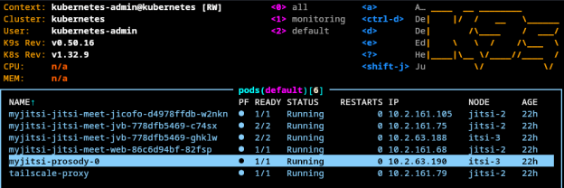
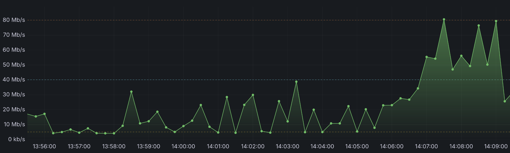

# {.plain .standout}

\centering
Skalowanie jvb

# Co zostało dodane do values.yaml?

* Aby przeskalować jvb, następujące wartości zostały dodane:

```yaml
jvb:
  ## Set JVB instance count:
  replicaCount: 2
  ## Expose JVB interface port to the outside world
  #  only on nodes that actually have it:
  useHostPort: true
  ## Make every JVB pod announce its Node's external
  #  IP address and nothing more:
  useNodeIP: true
octo:
  ## Enable OCTO support for both JVB and Jicofo:
  enabled: true
```

# OCTO - co to?

- OCTO to mechanizm multi-bridge routing, który pozwala rozproszyć uczestników jednego spotkania między wiele instancji Jitsi Videobridge (jvb).
- Bez OCTO każde spotkanie musi być obsługiwane przez jeden jvb; gdy osiągnie limit CPU/bitrate - jakość spada.
- Z OCTO spotkanie może używać kilku jvb jednocześnie.

# Przed skalowaniem jvb


# Po skalowaniu jvb



# Jak to wygląda w logach jicofo


# {.plain .standout}

\centering
Przetestowanie skalowania

# Szybkie przypomnienie

* Master Node - maszyna której rolą jest zarządzanie Kubernetes
* Worker Node - maszyna której rolą jest trzymać aplikacje (w podach) użytkownika

# Kubernetes

Co się okazuje:

* Master nie obsługuje ruchu użytkowników.
* Master nie uruchamia Podów aplikacyjnych.
* Master nie streamuje danych, nie przetwarza requestów HTTP, nie robi downloadów/uploadów.

# Kubernetes 2

Nawet jeśli master ma wolny internet (np. 1 Mbps), nie wpływa to na:

* prędkość odpowiedzi aplikacji,
* throughput,
* czas obsługi zapytań HTTP/Websocket/GRPC,
* szybkość pobierania danych przez aplikację.

# Kubernetes 3

To w trakcie stress testowania jitsi, gdy master ma 128kbit/s:



# Czemu nie uzylismy narzedzi zewnetrznych

Webrtcperf dla jitsi jest całkowicie zepsute.

# No to teraz jak przetestować jitsi...

Jitsi bardzo dobrze się skaluje. Według oficjalnych pomiarów:

* Dla 1056 strumieni wideo z bitrate 550mbit/s zużycie CPU to tylko 20% przy czterordzeniowym procesorze.
* Dla 1056 strumieni wideo Zużycie RAMu nie przekroczyło 1.5GB

# Czemu tak się dzieje?

Jitsi Videobridge jest tylko przekaźnikiem, bez żadnego transkodowania. Nie tworzy skomplikowanych reguł, ani nie weryfikuje nic.

Działa trochę jak router.

# {.plain .standout}

\centering
Demo

# {.plain .standout}

\centering
Dziękujemy za uwagę
